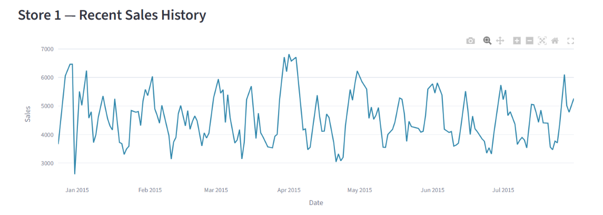
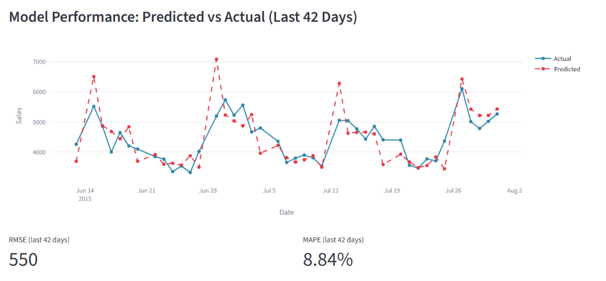
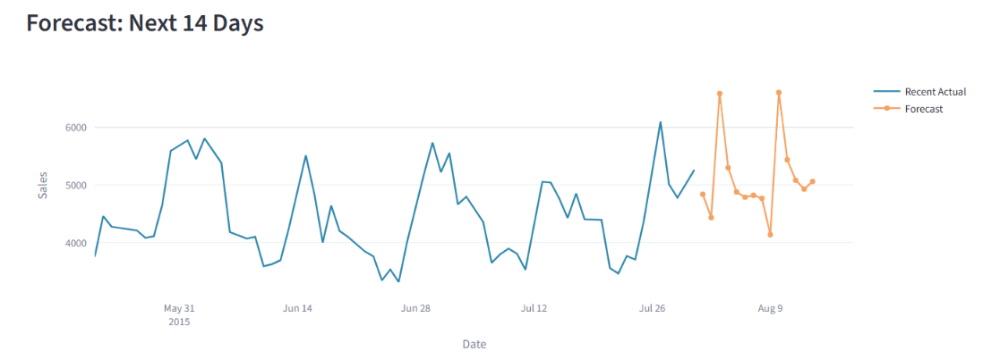

# Retail Demand Forecasting & Explainability Dashboard

An end-to-end machine learning system for forecasting daily retail sales using the Rossmann Store Sales dataset. The project compares a Linear Regression baseline against an XGBoost model, achieving a test RMSE of 949.51 and MAPE of 10.30%, while providing prediction explainability through SHAP within an interactive Streamlit dashboard.

## Business Problem

Retail businesses must accurately forecast future demand to optimize inventory planning, staffing, and promotional strategies.

This project predicts future daily sales for retail stores using historical sales patterns, promotional activities, holiday effects, and store-specific characteristics while explaining the factors driving each prediction.

---

## Dataset

**Rossmann Store Sales Dataset (Kaggle)**

* 1,115 retail stores
* Daily sales records from January 2013 to July 2015
* Over 1 million observations
* Includes:

  * Store information
  * Promotions
  * Holidays
  * Competition distance
  * Assortment type
  * Historical sales

Dataset used:

* `train.csv`
* `store.csv`

---

## Methodology

### 1. Data Preparation

Merged sales and store datasets using Store ID and performed preprocessing to handle missing values and categorical variables.

### 2. Feature Engineering

Generated time-series forecasting features including:

* Lag features:

  * Sales 1 day ago
  * Sales 7 days ago
  * Sales 14 days ago

* Rolling statistics:

  * 7-day rolling average
  * 30-day rolling average

* Calendar features:

  * Day of week
  * Month
  * Week of year
  * Weekend indicator

* Business features:

  * Promotions
  * Store type
  * Assortment
  * Competition distance
  * School holidays
  * State holidays

Final dataset:

* **828,782 rows**
* **30 engineered features**

---

## Modeling Approach

### Baseline Model

Linear Regression

### Main Model

XGBoost Regressor

### Validation Strategy

Implemented proper time-series validation:

* Time-based train/test split
* Final 42 days reserved as holdout test set
* Walk-forward validation using 3 rolling folds

This prevents future information leakage and better reflects real-world forecasting scenarios.

---

## Results

### Holdout Test Performance

| Model             | RMSE    | MAPE   |
| ----------------- | ------- | ------ |
| Linear Regression | 1304.73 | 14.88% |
| XGBoost           | 949.51  | 10.30% |

### Walk-Forward Validation

| Fold   | RMSE    | MAPE   |
| ------ | ------- | ------ |
| Fold 1 | 1195.35 | 12.18% |
| Fold 2 | 963.61  |   -    |
| Fold 3 | 936.91  | 10.23% |

*MAPE became unstable due to zero-sales observations in the validation window.

### Key Finding

XGBoost reduced prediction error by approximately **27%** compared with the Linear Regression baseline, demonstrating superior ability to capture nonlinear sales patterns.

---

## Explainability

Implemented SHAP (SHapley Additive Explanations) to provide transparent model predictions.

The dashboard identifies how factors such as:

* Promotions
* Holidays
* Recent sales trends
* Seasonal effects

influence individual sales forecasts.

---

## Dashboard Features

Built using Streamlit and Plotly.

Features include:

* Historical sales visualization
* Predicted vs actual sales comparison
* 14-day sales forecasting
* Forecast tables
* SHAP feature importance explanations
* Interactive store-level analysis

---

## Dashboard Preview

### Historical Sales Trends

### Predicted vs Actual Performance

### Future Sales Forecast

## Tech Stack

* Python
* Pandas
* NumPy
* Scikit-learn
* XGBoost
* SHAP
* Streamlit
* Plotly

---

## Project Workflow

Rossmann Dataset
→ Data Cleaning
→ Feature Engineering
→ Time-Based Validation
→ Linear Regression Baseline
→ XGBoost Forecasting
→ Performance Evaluation (RMSE, MAPE)
→ SHAP Explainability
→ Streamlit Dashboard

---

## Future Improvements

* Multi-step forecasting models
* LightGBM comparison
* Hyperparameter optimization
* Holiday-specific forecasting enhancements
* Cloud deployment

